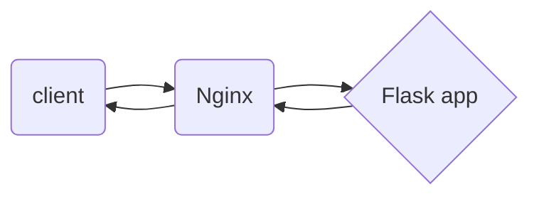

# Starting the server
To start your server you must run main.py
>python3 main.py

You wi get something like that:
> Serving Flask app 'app' (lazy loading)
*Environment: production
WARNING: This is a development server. Do not use it in a production deployment.
Use a production WSGI server instead.
 Debug mode: on
Running on http://127.0.0.1:5000/ (Press CTRL+C to quit)
Restarting with stat
Debugger is active!
Debugger PIN: 143-604-576

To test the server, you need to make a request to the link that is specified in app@route.
>curl -X POST --from file=@/path/to/your/main.tf http://127.0.0.1:5000/file-upload

*Default port 5000 for Flask server 

If everything is correct , you will see:  
>resource "aws_security_group" "webserver" {
name = "SG_WebServer"
description = "SG for web"
ingress {
from_port = 81
to_port = 80
protocol = "tcp"
cidr_blocks = ["0.0.0.0/0"]
}
ingress {
from_port = 443
to_port = 443
protocol = "tcp"
cidr_blocks = ["0.0.0.0/0"]
}
egress {
from_port = 0
to_port = 0
protocol = "-1"
cidr_blocks = ["0.0.0.0/0"]
}

## Dockerfile
In this part you will create a Dockerfile to build a new image for container.

For this case you need
* You need to create Dockerfile in the same directory along with directory app.
* You need to change pathes in main.py, app.py, mv.py
You will use  tiangolo/uwsgi-nginx-flask image. Its already builded flask server. All we need its to copy our app directoy to it
>FROM tiangolo/uwsgi-nginx-flask:python3.8
RUN apt-get update
COPY ./app /app

>docker build -t < name of your image > .

Lets test our new image:
>docker run -p 80:80 -d  < name or id of new image >

>curl -X POST --from file=@/path/to/your/main.tf http://127.0.0.1/file-upload

If everything is alright, we will make a new container with proxi

## docker-compose
 For second container you will use nginx image. Еhe container should forward requests to the first container

To do this, you need to create an nginx.conf file. We will replace the default.conf file in the server

nginx.conf will look like this:
>server {
listen 8080;
server_name 127.0.0.1;
location / {
proxy_set_header Host $host;
proxy_pass http://service1:80;
}
}

Nginx will redirect request to the container with name "service1". 
Both containers were launched via docker-compose. Ыo they are on the same local network. It's like DNS

docker-compose: 
>version: "3.9"
services:
nginx-router:
image: "nginx:latest"
volumes:
--type: bind
source: ./nginxconfig/nginx.conf
target: /etc/nginx/conf.d/default.conf
ports:
>-- "8080:8080"
depends_on:
-- service1
service1:
image: "final_app"
expose:
-- "80"

>docker-compose up -d  

>curl -X POST --from file=@/path/to/your/main.tf http://127.0.0.1:8080/file-upload

Scheme of our containers:

