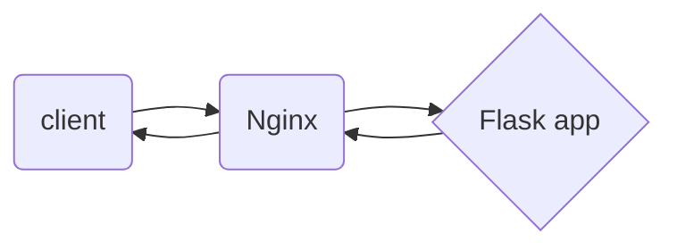

# REST API 
A REST API (also known as RESTful API) is an application programming interface (API or web API) that conforms to the constraints of REST architectural style and allows for interaction with RESTful web services.
When a client request is made via a RESTful API, it transfers a representation of the state of the resource to the requester or endpoint. This information, or representation, is delivered in one of several formats via **HTTP: JSON (Javascript Object Notation), HTML, XLT, Python, PHP, or plain text. JSON** is the most generally popular file format to use because, despite its name, it’s language-agnostic, as well as readable by both humans and machines.

This web server with RESTful API was built with Flask framework.  To use it you need to install dependencies:

-python3.8
> $ sudo apt update
> $ sudo apt install python3.9 
> $ python3.9 -V 

-virtualenv
> $ sudo apt install -y python3-venv

Lets start with creating virutal env. and install in the env. Flask framework 
> $ virtualenv flask
> $ cd flask
> $ flask/bin/pip install flask

after that we can create file **main.py** and **app.py**. . You can download files form GitHub repo (https://github.com/lisaegor1/lisaproject.git)
## main.py
First of all you need to provide your main.py with libraries
>import os
import urllib.request
import shutil
from os import path
from app import app
from mv import mv
from txt import text
from flask import Flask, request, redirect, jsonify, send_from_directory, abort, render_template
from werkzeug.utils import secure_filename

These libraries are needed for the normal functionality of the framework and the built-in functions of python
> shutil, os --> python
> mv, txt, app --> built-in functions
> Flask, request, send_from_directory, abort, render_template --> for framework

You can define wich format files will be upload to your server
> ALLOWED_EXTENSIONS = set(['txt', 'pdf', 'png', 'jpg', 'jpeg', 'gif', 'tf'])
def allowed_file(filename):
return '.' in filename and filename.rsplit('.', 1)[1].lower() in ALLOWED_EXTENSIONS

The most important part on main.py is app@route.  We use the  route()  decorator to tell Flask what URL should trigger our function.
I made one trigger that activates the function when you make a POST request

When you make a request (via curl), you are specifying a file to upload to the server. The function checks if the request contains a file.
>  check if the post request has the file part
if 'file' not in request.files:
resp = jsonify({'message' : 'No file part in the request'})
resp.status_code = 400
return resp
file = request.files['file']
if file.filename == '':
resp = jsonify({'message' : 'No file selected for uploading'})
resp.status_code = 400
return resp

 If the request passed the test, then the file is uploaded to the server. After that, the file will be processed by the txt.py and mv.py functions. They will extract the data about security groups and move the file with them to the templates folder

>if file and allowed_file(file.filename):
filename = secure_filename(file.filename)
file.save(os.path.join(app.config['UPLOAD_FOLDER'], filename))
resp = jsonify({'message' : 'File successfully uploaded'})
resp.status_code = 201
text()
mv()
return render_template('sg.txt')

The condition __name__ == "__main__" ensures that the run() method is called only when main.py is run as the main program
>if __name__ == "__main__":
app.run(debug=True)

## app.py
In in file you need to specify variables for main.py.
>UPLOAD_FOLDER = '/home/yehor/tz'
app.secret_key = "secret key"
app.config['UPLOAD_FOLDER'] = UPLOAD_FOLDER
app.config['MAX_CONTENT_LENGTH'] = 16 * 1024 * 1024

The nost imprtant is UPLOAD_FOLDER. You need to specify the path to the folder of our project (where the uploaded files will be stored)
## txt.py and mv.py 
**txt.py**
This script finds in the main.tf file (which we will upload to the server) security groups. After that, the script creates the sg.txt file

**mv.py**
The main goal of the script is to drop the sg.txt file into the ***templates*** folder. 
**Important!** by default Flask server looks for pages in the teplates folder.
>FROM MAIN.PY

>render_template('sg.txt')

# Starting the server
To start your server you must run main.py
>python3 main.py

You wi get something like that:
> Serving Flask app 'app' (lazy loading)
*Environment: production
WARNING: This is a development server. Do not use it in a production deployment.
Use a production WSGI server instead.
 Debug mode: on
Running on http://127.0.0.1:5000/ (Press CTRL+C to quit)
Restarting with stat
Debugger is active!
Debugger PIN: 143-604-576

To test the server, you need to make a request to the link that is specified in app@route.
>curl -X POST --from file=@/path/to/your/main.tf http://127.0.0.1:5000/file-upload

*Default port 5000 for Flask server 

If everything is correct , you will see:  
>resource "aws_security_group" "webserver" {
name = "SG_WebServer"
description = "SG for web"
ingress {
from_port = 81
to_port = 80
protocol = "tcp"
cidr_blocks = ["0.0.0.0/0"]
}
ingress {
from_port = 443
to_port = 443
protocol = "tcp"
cidr_blocks = ["0.0.0.0/0"]
}
egress {
from_port = 0
to_port = 0
protocol = "-1"
cidr_blocks = ["0.0.0.0/0"]
}

## Dockerfile
In this part you will create a Dockerfile to build a new image for container.

For this case you need
* You need to create Dockerfile in the same directory along with directory app.
* You need to change pathes in main.py, app.py, mv.py
You will use  tiangolo/uwsgi-nginx-flask image. Its already builded flask server. All we need its to copy our app directoy to it
>FROM tiangolo/uwsgi-nginx-flask:python3.8
RUN apt-get update
COPY ./app /app

>docker build -t < name of your image > .

Lets test our new image:
>docker run -p 80:80 -d  < name or id of new image >

>curl -X POST --from file=@/path/to/your/main.tf http://127.0.0.1/file-upload

If everything is alright, we will make a new container with proxi

## docker-compose
 For second container you will use nginx image. Еhe container should forward requests to the first container

To do this, you need to create an nginx.conf file. We will replace the default.conf file in the server

nginx.conf will look like this:
>server {
listen 8080;
server_name 127.0.0.1;
location / {
proxy_set_header Host $host;
proxy_pass http://service1:80;
}
}

Nginx will redirect request to the container with name "service1". 
Both containers were launched via docker-compose. Ыo they are on the same local network. It's like DNS

docker-compose: 
>version: "3.9"
services:
nginx-router:
image: "nginx:latest"
volumes:
--type: bind
source: ./nginxconfig/nginx.conf
target: /etc/nginx/conf.d/default.conf
ports:
>-- "8080:8080"
depends_on:
-- service1
service1:
image: "final_app"
expose:
-- "80"

>docker-compose up -d  

>curl -X POST --from file=@/path/to/your/main.tf http://127.0.0.1:8080/file-upload

Scheme of our containers:

